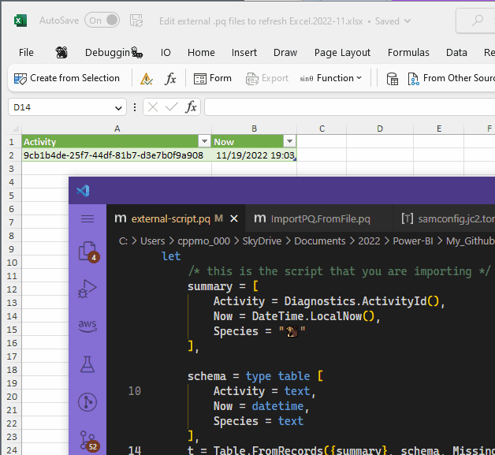

## About

Have you ever wished you could edit a PowerQuery script without having to open Excel's import UI? 
Because it blocks using the rest of the UI, until you close it.

- [Edit PQ Outside of Excel.xlsx](Edit%20external%20.pq%20files%20to%20refresh%20Excel.2022-11.xlsx) workbook
- [ImportPQ.FromFile](pq/ImportPQ.FromFile.pq) is a helper function to import files
- [external-script.pq](pq/external-script.pq) is a sample file to import

