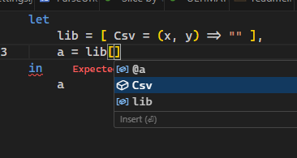
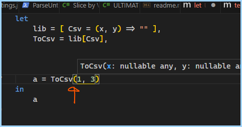

## About

I tested whether using library functions as records could autocomplete in **Power BI** or **VsCode**. I came across the question in a [/r/powerbi](https://www.reddit.com/r/PowerBI/comments/1b43ces/comment/kszlqqr/?utm_source=share&utm_medium=web2x&context=3) thread. I had to find out.

Some of the results were expected, some surprised me. 

- [About](#about)
  - [Sample Implementation](#sample-implementation)
  - [Final Summary](#final-summary)
    - [Vs Code](#vs-code)
    - [Power BI Desktop](#power-bi-desktop)
  - [Test Cases](#test-cases)
    - [Part 1 : Nested lib record](#part-1--nested-lib-record)
    - [Part 2 : Aliases with nested lib record](#part-2--aliases-with-nested-lib-record)
  - [Limitations and Test Constraints](#limitations-and-test-constraints)
  - [Future Work](#future-work)
  - [Environment](#environment)

### Sample Implementation 

I prepared two files that that try a few variations for a controlled test. They are identical, except the 2nd one uses documentation metadata.

- [withoutDocMetadata.pq](./Test-Nested-LibFunctions-For-Completion.pq)
- [withDocMetadata.pq](./Test-Nested-LibFunctions-For-Completion-withDocstringsMetadata.pq)

### Final Summary

#### Vs Code

- typing `[` **shows** field names for records like `Stuff` for `lib[Stuff]`
- typing `(` **does not** show the signature for `lib[Stuff]()`
- typing `,` **does not** show the signature for `lib[Stuff]( a, b )`
- typing `(` **shows** signatures for function aliases like `ToCsv` for `ToCsv = lib[Stuff]`

#### Power BI Desktop

- typing `[` **does not** show field names for records like `Stuff` for `lib[Stuff]`
- typing `(` **shows** the signature for `lib[Stuff]()`
- typing `,` **shows** the signature for `lib[Stuff]( a, b )`
- typing `(` **does not** show signatures for function aliases like `ToCsv` for `ToCsv = lib[Stuff]`

### Test Cases

#### Part 1 : Nested lib record

```ts
let 
    lib = [ Csv = (x, y) => "" ],
    a = lib[Csv]( 4, 5 )
in 
    a
```

**Power BI Desktop**

| Test                             | Works? |
| -------------------------------- | ------ |
| `[` Function Name Completes?     | 👎      |
| `(` Open Parens Shows Signature? | 👍      |
| `,` Comma Shows Signature?       | 👍      |

**Vs Code**

| Test                             | Works? |
| -------------------------------- | ------ |
| `[` Function Name Completes?     | 👍      |
| `(` Open Parens Shows Signature? | 👎      |
| `,` Comma Shows Signature?       | 👎      |



#### Part 2 : Aliases with nested lib record

Using this query

```ts
let
    lib = [ Csv = (x, y) => "" ],
    ToCsv = lib[Csv],
    a = ToCsv(1, 3) // test complitions for this line
in 
    a
```

**Power BI Desktop**

| Test                             | Works? |
| -------------------------------- | ------ |
| Function Name Completes?         | 👍      |
| `(` Open Parens Shows Signature? | 👎      |
| `,` Comma Shows Signature?       | 👎      |

**Vs Code**

| Test                             | Works? |
| -------------------------------- | ------ |
| Function Name Completes?         | 👍      |
| `(` Open Parens Shows Signature? | 👍      |
| `,` Comma Shows Signature?       | 👍      |




### Limitations and Test Constraints 

To keep things simple for this first test, I kept things simple

- For `Power BI Desktop` I am using the `Advanced Editor` for test cases
- For VsCode I am using the [base Power Query Extension](https://marketplace.visualstudio.com/items?itemName=PowerQuery.vscode-powerquery). ( There is a [Power Query SDK for VsCode](https://marketplace.visualstudio.com/items?itemName=PowerQuery.vscode-powerquery-sdk) too )
- I declared the library record as a hidden step of the same query
 
### Future Work

- Test with `PowerBI-Copilot`
- Test with the library declared in an external file, with and without `github copilot` in the shared workspace
- Test with an external file using Evaluate on the global `environment`
- Dive into the `AST`, to see if I can statically generate more suggestions for Vs Code
- Test if I can get the function signature to display for single argument functions, or at least on the `(` press
- Sometimes a test didn't seem to be 100% reproducible. 
  - Future tests with invalidated caches
  - New tests using saved files, *after* fully running `apply`. Not just refreshing / saving.
- Experiment with VsCode Settings:

```json
"powerquery.diagnostics.typeStrategy": "Extended",
"powerquery.general.mode": "SDK", // [ Power Query* | SDK ],
"[powerquery]": {
    "github.copilot.editor.enableAutoCompletions": true,
    // "*suggest*": // a bunch of settings
},
```

### Environment

```yml
PowerBI Desktop: 'Power Query 2.126.927.0 64-bit (February 2024)'
VsCode Addon: 'PowerQuery.vscode-powerquery v0.1.54'
Date Tested: '2024-03-02'
```