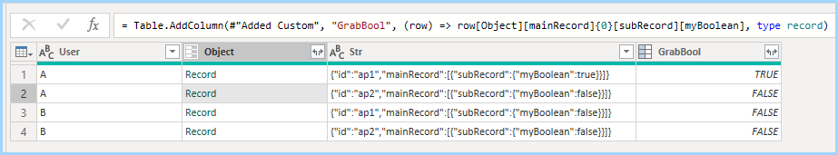

[Root](https://github.com/ninmonkey/ninMonkQuery-examples) | [Up ⭡](./../readme.md)

- [Ex1 Tables from Mixed Json](#ex1-tables-from-mixed-json)
- [Ex2 Nested Json](#ex2-nested-json)

## Ex1 Tables from Mixed Json


- Report [Extracting 2 tables.pbix](./Transform%20Json%20-%20Extracting%20Tables%20from%20Mixed%20Json.pbix)
- Query [Extracting 2 tables.pq](./pq/Transform%20Json%20-%20Extracting%20Tables%20from%20Mixed%20Json.md)

## Ex2 Nested Json

- Query [Filtering Nested Json.pq](./pq/filtering-nested-json.md)
- Report [Filtering Nested Json.pbix](./Filter%20Json%20-%20Filtering%20Nested%20Values%20Without%20Expanding%20values.pbix) 



```js
/* 
    previews into the depths of an object,
    it's converted to a tiny json file, then decoded as text
*/
XRay = (source as any) as text => [
    bytes = Json.FromValue(source, TextEncoding.Utf8),
    str = Text.FromBinary(bytes, TextEncoding.Utf8)
    ][str],
```
