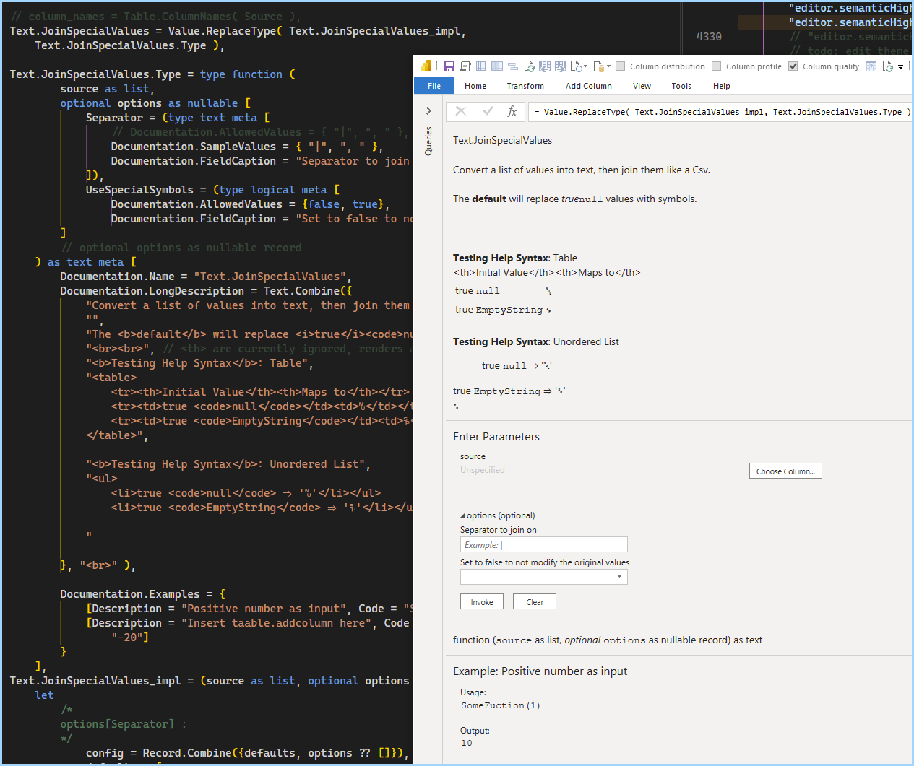

[Root](https://github.com/ninmonkey/ninMonkQuery-examples) | [Up ⭡](./..)

## Types: Ascribing Extra Metadata to your Functions

- [PowerQuery.pq](./pq/joining-text%20as%20pipes%20from%20auto-coerced-column-values.pq)
- [Report.pbix](./joining-text%20as%20pipes%20from%20auto-coerced-column-values.pbix)
- Note: it works, I'm half way through writing it

[view](./img/joining-text%20as%20pipes%20from%20auto-coerced-column-values-01.png)

[view](./img/testing-documentation-on-ascribed-type.png)

## See More: Function Metadta Related Documentation and Examples

Ben Gribaudo
- [describing-function-record-parameters](https://bengribaudo.com/blog/2021/09/21/6179/describing-function-record-parameters) 2021/09/21 
- [power-query-m-primer-part18-type-system-iii-custom-types#function](https://bengribaudo.com/blog/2020/06/02/5259/power-query-m-primer-part18-type-system-iii-custom-types#function) 2020/06/02 
- [describing-function-record-parameters#Specifying%20the%20Shape](https://bengribaudo.com/blog/2021/09/21/6179/describing-function-record-parameters#Specifying%20the%20Shape) 2021/09/21 
- [power-query-m-primer-part19-type-system-iv-ascription-conformance-and-equalitys-strange-behaviors](https://bengribaudo.com/blog/2020/09/03/5408/power-query-m-primer-part19-type-system-iv-ascription-conformance-and-equalitys-strange-behaviors) 2020/09/03 
- [power-query-m-primer-part16-type-system-i-basics](https://bengribaudo.com/blog/2020/02/05/4948/power-query-m-primer-part16-type-system-i-basics) 2020/02/05 

