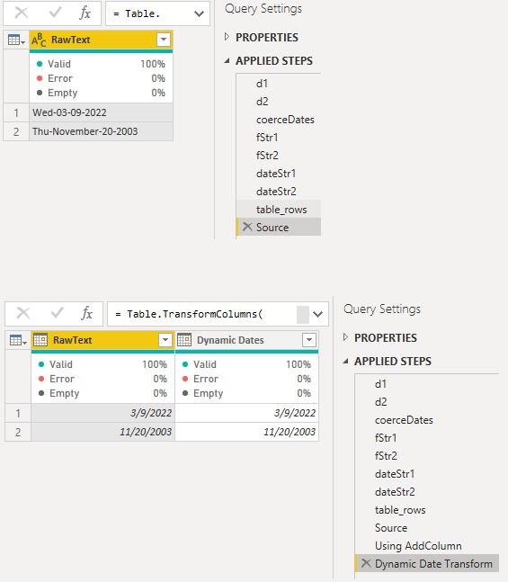

[Root](https://github.com/ninmonkey/ninMonkQuery-examples) | [Up ⭡](./..)

- [Safer Import: using the Culture Parameter to ensure Format](#safer-import-using-the-culture-parameter-to-ensure-format)
- [Types: Ascribing Extra Metadata to your Functions](#types-ascribing-extra-metadata-to-your-functions)
- [Multiple Date Formats in one Transform](#multiple-date-formats-in-one-transform)
- [See More: Function Metadata Related Documentation and Examples](#see-more-function-metadata-related-documentation-and-examples)

## Safer Import: using the Culture Parameter to ensure Format

Tons of functions implicitly use the culture of your machine, like  `en-us`. Any time Dates, or Numbers are imported from a text datasource. You can check yours using the query `= Culture.Current`

If your file has this text `10,300`, how should it convert to an integer? Ran on a machine set to US, and other in Europe: You end up with a value **1000** times larger. Hopefully that wasn't important. 

<table>
    <tr>
        <th>Power Query</th>
        <th>Output</th>
    </tr>
<tr>
<td>

```ts
[
    string  = "10,300",
    Us = Number.From( string, "en-us" ), 
    German = Number.From( string, "de-de" ),
    ratio = Us / German
]
```

</td><td>

```yaml
string: "10,300"
Us: 10300
German: 10.3
Ratio: 999.99999999999989
```

</td>
</tr>
</table>
<table><tr><td>
<a href ="./pq/Importing%20Numbers%20Using%20Culture%20Parameters.pq">PowerQuery.pq</a>
</td><td>
<a href ="./How%20to%20Import%20Numbers%20Safely%20Without%20Errors%20-%20using%20Culture.pbix">How to Import Numbers Safely Without Errors.pbix</a>
</td></tr></table>


## Types: Ascribing Extra Metadata to your Functions

Ascribing extra **metadata** to your `functions`

- [PowerQuery.pq](./pq/joining-text%20as%20pipes%20from%20auto-coerced-column-values.pq)
- [Report.pbix](./joining-text%20as%20pipes%20from%20auto-coerced-column-values.pbix)
- Note: it works, I'm half way through writing it


[view](./img/joining-text%20as%20pipes%20from%20auto-coerced-column-values-01.png)


[view](./img/testing-documentation-on-ascribed-type.png)

## Multiple Date Formats in one Transform



Converting-Multiple-DateFormats-In-One-Column
- [query.pq](./pq/Converting-Multiple-DateFormats-In-One-Column.pq) or [report.pbix](./Converting-Multiple-DateFormats-In-One-Column.pbix)

## See More: Function Metadata Related Documentation and Examples

Ben Gribaudo
- [describing-function-record-parameters](https://bengribaudo.com/blog/2021/09/21/6179/describing-function-record-parameters) 2021/09/21 
- [power-query-m-primer-part18-type-system-iii-custom-types#function](https://bengribaudo.com/blog/2020/06/02/5259/power-query-m-primer-part18-type-system-iii-custom-types#function) 2020/06/02 
- [describing-function-record-parameters#Specifying%20the%20Shape](https://bengribaudo.com/blog/2021/09/21/6179/describing-function-record-parameters#Specifying%20the%20Shape) 2021/09/21 
- [power-query-m-primer-part19-type-system-iv-ascription-conformance-and-equalitys-strange-behaviors](https://bengribaudo.com/blog/2020/09/03/5408/power-query-m-primer-part19-type-system-iv-ascription-conformance-and-equalitys-strange-behaviors) 2020/09/03 
- [power-query-m-primer-part16-type-system-i-basics](https://bengribaudo.com/blog/2020/02/05/4948/power-query-m-primer-part16-type-system-i-basics) 2020/02/05 


